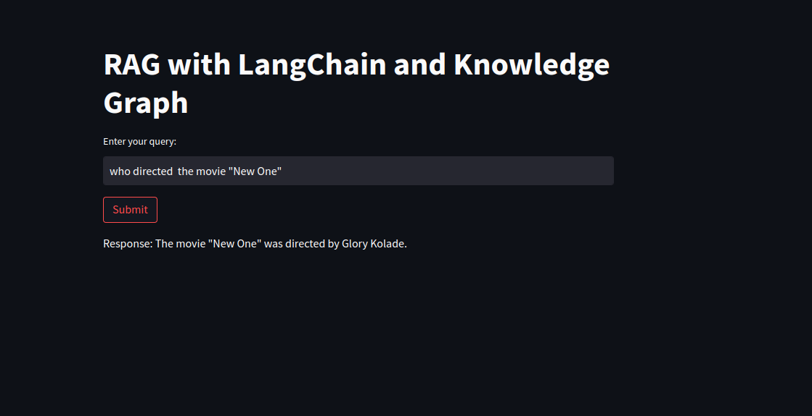
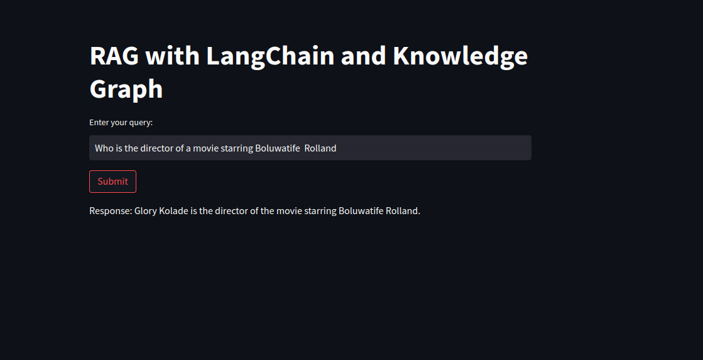
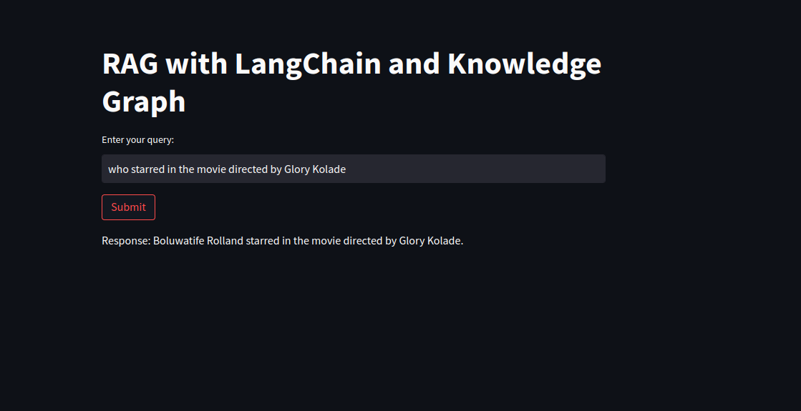

# RAG Application with Knowledge Graph

This project demonstrates a Retrieval-Augmented Generation (RAG) application using a Knowledge Graph to provide context-aware responses from a language model. The application is built using Python, NetworkX for the knowledge graph, and Streamlit for the web interface.






## Table of Contents

- [Installation](#installation)
- [Setup](#setup)
- [Architecture](#architecture)
- [Running the Project](#running-the-project)
- [Usage](#usage)
- [Examples](#examples)


## Installation

1. **Clone the repository**:
    
    git clone https://github.com/GloryKO/RAG-TEST.git
    cd RAG-TEST
    

2. **Create and activate a virtual environment**:
   
    python -m venv venv
    source venv/bin/activate  # On Windows, use `venv\Scripts\activate`
    

3. **Install dependencies**:
  
    pip install -r requirements.txt

## Setup

1. **Environment Variables**: Create a `.env` file in the root directory of the project and add your OpenAI API key:
    
    OPENAI_API_KEY=your_openai_api_key
    

2. **Project Structure**:
    ```
    ├── main.py
    ├── knowledge_graph.py
    ├── llm_graph_transformer.py
    ├── requirements.txt
    ├── .env
    _.gitignore
    ├── README.md
    - screnshots
    ```

## Architecture

The project is structured into three main modules:

1. **Knowledge Graph Module (`knowledge_graph.py`)**:
    - Handles the creation and management of a knowledge graph using NetworkX.
    - Adds data to the graph and retrieves context relevant to a query.

2. **LLM Graph Transformer Module (`llm_graph_transformer.py`)**:
    - Integrates with OpenAI's GPT-3.5-turbo model.
    - Uses the context from the knowledge graph to generate context-aware responses.

3. **Streamlit Application (`main.py`)**:
    - Provides a user interface for interacting with the knowledge graph and the LLM.
    - Takes user queries and displays the generated responses.

## Running the Project

1. **Start the Streamlit application**:
    ```sh
    streamlit run main.py
    ```

2. **Access the application**: Open your web browser and go to `http://localhost:8501`.

## Usage

1. **Enter your query**: Type a question or a prompt into the text input field.
2. **Submit the query**: Click the "Submit" button to send the query.
3. **View the response**: The application will display a response generated by the language model using the context from the knowledge graph.

## Examples

Here are some example queries you can try:

1. **Basic Entity Queries**:
   - "Tell me about Inception."
   - "Who directed Interstellar?"
   - "Who starred in Mad Max: Fury Road?"
   - "who directed the movie "New One"?" #this is testing with sample data not online but in the KG
   - "Who starred in the Movie "New One" ? #also testing with sample data not availabe online but in the KG

2. **Relation-Based Queries**:
   - "Who directed Inception?"
   - "What genre is The Matrix?"
   - "Who starred in Interstellar?"

3. **Complex Queries**:
   - "Which movies were directed by Christopher Nolan?"
   - "List all actors in Science Fiction movies."
   - "Tell me about movies in the Action genre."

4. **Edge Case Queries**:
   - "What is the genre of Inception?"
   - "Who is the director of a movie starring Leonardo DiCaprio?"
   - "who is the director of a movie starring Boluwatife Rolland?"
   
